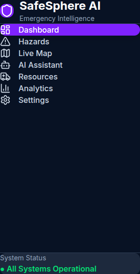

# 🚨 SafeSphere AI

> AI-Powered Emergency Preparedness & Decision Intelligence Platform

---

## 🌍 Live Demo

https://gen-lang-client-0623927789.web.app

---

## 📖 Overview

SafeSphere AI is an intelligent emergency preparedness platform that combines real-time weather, emergency resources, Google Maps, Firebase Firestore, and Gemini AI to help emergency responders make faster and smarter decisions.

---
## 📸 Application Preview

### Dashboard

### Emergency Operations Map

### AI Operational Briefing

### Resource Monitoring

## ✨ Features

- 🚨 Emergency Operations Dashboard
- 🗺 Interactive Google Maps
- 🔥 Live Firestore Updates
- 🤖 Gemini AI Operational Briefings
- 🌦 Weather Intelligence
- 📈 Community Risk Analytics
- 🚑 Emergency Resource Monitoring
- ⚡ Real-time Decision Support

---

## 🛠 Tech Stack

- React
- TypeScript
- Vite
- Tailwind CSS
- Firebase Firestore
- Firebase Hosting
- Google Maps Platform
- Gemini AI
- Google Cloud

---

## 🚀 Future Roadmap

- Vertex AI
- BigQuery Analytics
- Route Optimization
- Predictive Disaster Forecasting
- Mobile App
- Multi-city Monitoring

---

## 👨‍💻 Developer

Naresh K

LinkedIn:
https://www.linkedin.com/in/nareshaspire

---

## 📜 License

MIT License
